# Loan Default Risk: Exploratory Data Analysis and Baseline Model.
## By Huda Alsaud

## 1. Project Objective and Research Question.

### Research Question
Can we identify borrowers who are at higher risk of default so that a financial institution can make better lending and credit-risk decisions?

### Project Objective
The objective of this project is to use historical borrower and loan data to investigate characteristics and patterns associated with loan default. The analysis will use data cleaning, exploratory data analysis, feature engineering, and visualization techniques to develop a better understanding of the factors related to default risk.

A baseline classification model will then be developed to establish an initial benchmark for predicting loan default. The model's performance will be evaluated using an appropriate evaluation metric, with the choice of metric justified according to the classification problem and business context.

The results of the analysis will be used to answer the research question and provide information that may help financial institutions better understand credit risk and make more informed lending decisions.

### Rationale
Loan default can create financial losses for lending institutions and increase uncertainty when making credit decisions. Identifying borrower and loan characteristics associated with higher observed default risk can help financial institutions better understand lending risk and make more informed credit-risk decisions. This analysis is therefore relevant because it examines whether the available borrower and loan information can provide useful signals for identifying borrowers who may be at higher risk of default.

## 2. Data Used
The analysis uses the Loan Default Dataset, publicly available through Kaggle. The dataset contains historical information about loan applications, borrowers, financial characteristics, credit information, property characteristics, and loan outcomes.

Source: Kaggle — Loan Default Dataset [Loan Default Dataset – Kaggle](https://www.kaggle.com/datasets/yasserh/loan-default-dataset)
The dataset contains 148,670 observations and 34 features, including 33 predictor variables and one target variable (Status).

## 3. Analysis Approach and Methodology
The analysis will follow a structured process designed to move from understanding the raw data to developing an initial predictive model.
First, the dataset will be inspected and cleaned to address issues such as missing values, duplicate observations, incorrect data types, and potentially invalid values. Next, exploratory data analysis will be conducted to examine distributions, patterns, and relationships among borrower characteristics, loan characteristics, and default outcomes.
Outliers and unusual observations will also be investigated and feature engineering will then be used where appropriate.
Following the exploratory analysis, the prepared data will be used to develop a baseline classification model. The model will be evaluated using an appropriate performance metric, and the result will be interpreted in relation to the research question and business problem.

## 4. Data Cleaning and Preparation
The dataset was cleaned and prepared to ensure that the analysis and modeling were based on reliable and meaningful information. Missing values were reviewed to understand their distribution and relationship with the target variable. The largest missing values were found in Upfront_charges, Interest_rate_spread, and rate_of_interest. 

For Upfront_charges and rate_of_interest, missing values were heavily concentrated among default observations. Removing these observations would have eliminated the default group needed for classification, so these features were removed rather than deleting the affected observations. Interest_rate_spread was also removed because it had no observed values for the default group (Status 1) and its available observations belonged only to the non-default group (Status 0), meaning it could not provide useful information for comparing the two target categories. The ID feature was removed because it is only an identifier, while yearwas removed because it contained the same value (2019) for all observations. 

The features construction_type, Secured_by, and Security_Type were also removed because each contained only 33 observations in one category and therefore provided very limited variation. Duplicate observations were checked, and none were identified.

The remaining data was further reviewed for unusual values and potential anomalies. In particular, LTV values above approximately 125% were identified as unusually high and were treated as anomalous based on both statistical analysis and their business interpretation. After the cleaning process, the dataset contained 120,422 observations and 26 features, including the target variable Status, with no remaining missing values. The cleaned dataset retained both target categories, with 100,878 non-default observations (Status 0) and 19,544 default observations (Status 1), providing a consistent dataset for exploratory analysis and baseline classification modeling.

## 5. Exploratory Data Analysis
The exploratory data analysis examined borrower and loan characteristics to identify patterns associated with loan default and to better understand which features may help distinguish borrowers with different levels of observed default risk. For categorical features, observed default rates were compared across categories. Five features showed the largest differences in default rates and were selected for further analysis: lump_sum_payment, Neg_ammortization, loan_type, 
business_or_commercial, and loan_purpose. Selected figures are included below.

  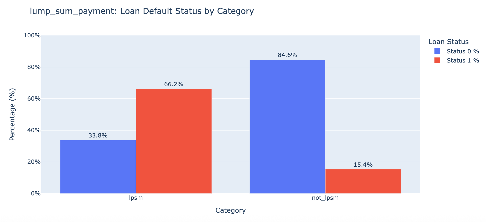

  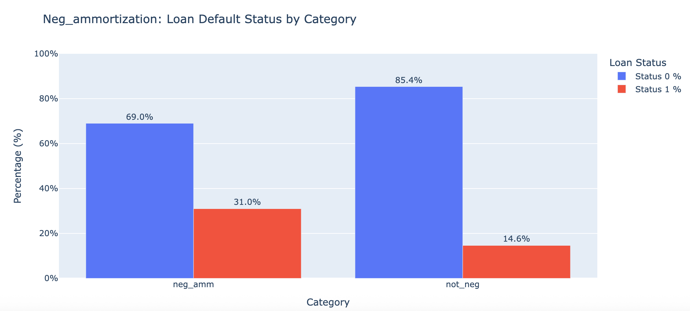

  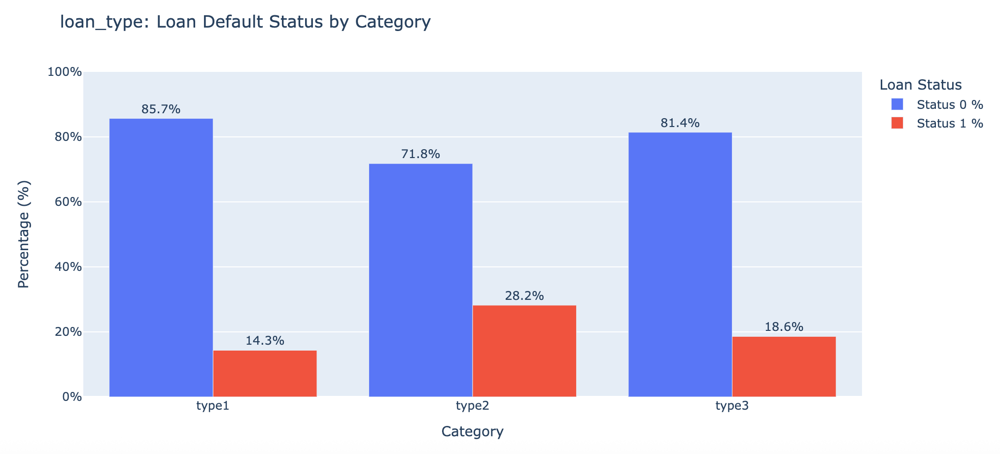

  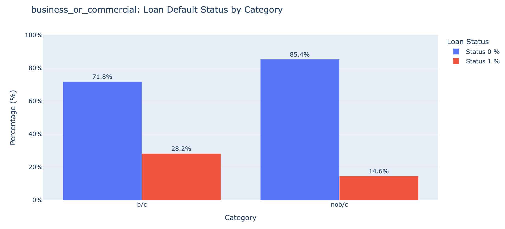

These differences indicate that borrowers with different loan and payment characteristics may have different levels of observed default risk, which can help financial institutions identify groups that may require closer credit-risk assessment.

 Among these features, lump_sum_payment and Neg_ammortization showed particularly clear differences, with the lpsm and neg_amm categories generally showing higher observed default rates than their corresponding categories. From a lending perspective, these payment characteristics may provide useful signals when assessing the level of repayment risk associated with different borrowers. Loan type also showed differences, with Type 1 generally showing lower default rates than Type 2 across much of the analysis. This suggests that the structure or type of loan may be relevant when distinguishing borrowers with different observed levels of default risk. These patterns indicate that different loan characteristics can distinguish groups with different observed levels of default risk.
 
Numerical features were also compared between defaulted and non-defaulted borrowers. The largest observed difference was in income, where the average income of defaulted borrowers was lower than that of non-defaulted borrowers. This indicates that income may provide useful information when assessing a borrower's ability to manage loan obligations. property_value also showed a lower average among defaulted borrowers, while dtir1 showed a higher average. A higher dtir1 represents a greater level of debt relative to income, making it a relevant measure when assessing a borrower's financial burden. 

  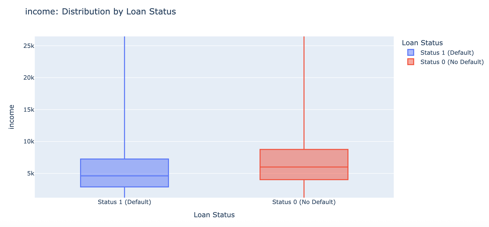

  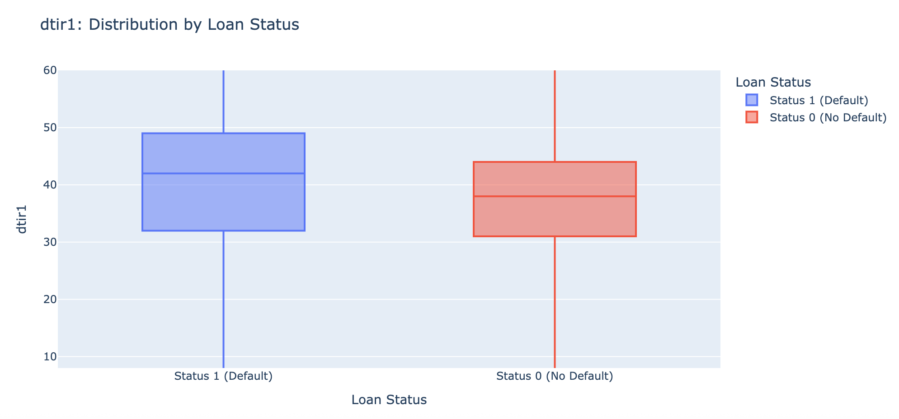

The correlation analysis further showed meaningful relationships among numerical features, particularly between loan_amount and property_value. This relationship is relevant from a lending perspective because the amount borrowed is connected to the value of the property supporting the loan. 

  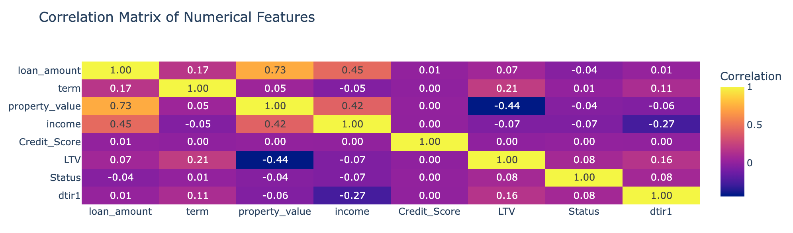

Additional analysis of numerical and categorical features showed that loan amount alone did not display a clear relationship with observed default rates, while categorical characteristics such as lump_sum_payment, Neg_ammortization, and loan_type showed clearer patterns. 

  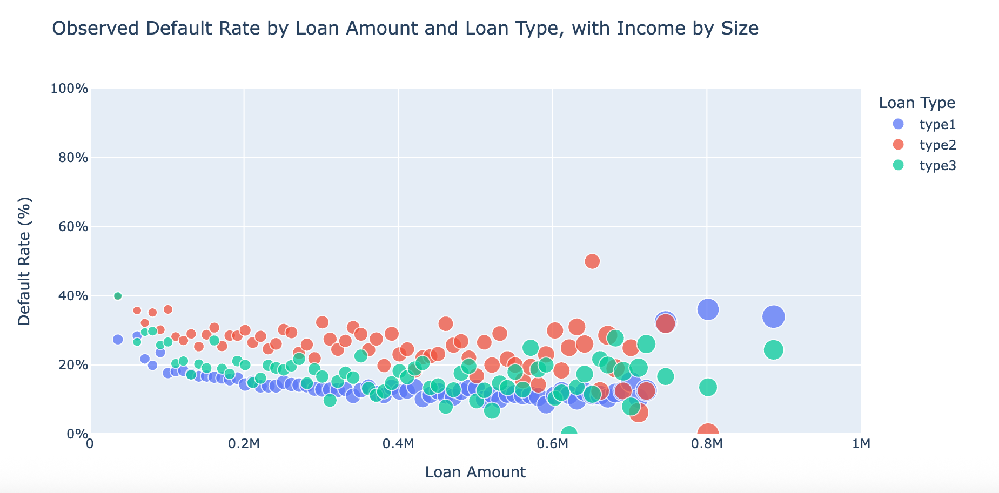

  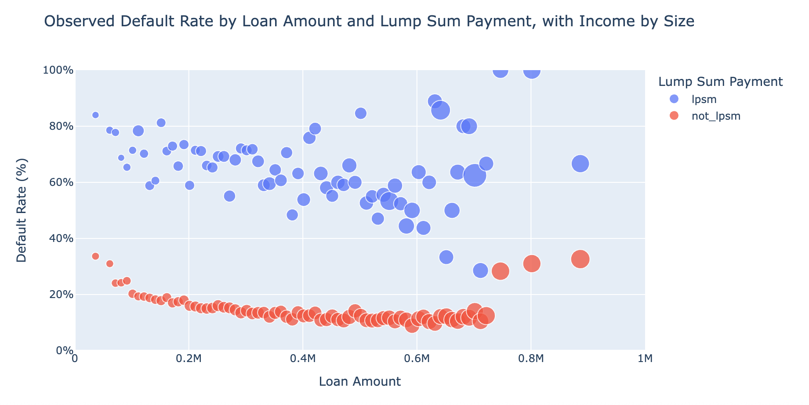

  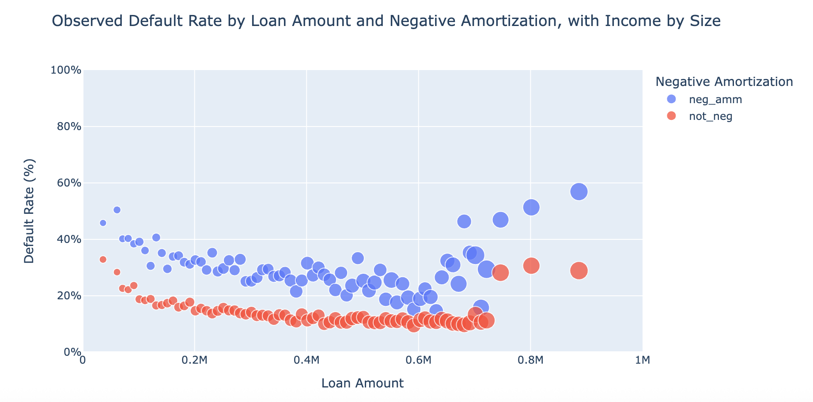

dtir1 levels also revealed variation in default rates, with the lowest observed rates generally occurring in the middle dtir1 ranges and higher rates at both lower and upper ranges. In particular, the 50–60 dtir1 range had the highest overall observed default rate at 42.67%, compared with lower rates across several middle dtir1 ranges. 

  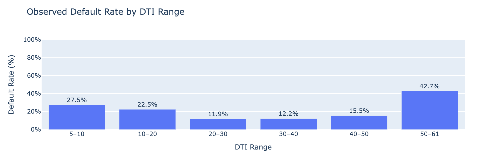

This indicates that borrowers with higher debt relative to income represented a group with substantially higher observed default rates in the dataset. The relationship between dtir1 and loan characteristics also varied across groups, suggesting that borrower and loan characteristics may provide more useful information when considered together rather than individually.

Moreover, Income shows a generally negative association with observed default rates across most categories, but the strength and consistency of the pattern differ by category. The lpsm category is the main exception, showing high and widely distributed default rates without a clear income-related downward pattern.

  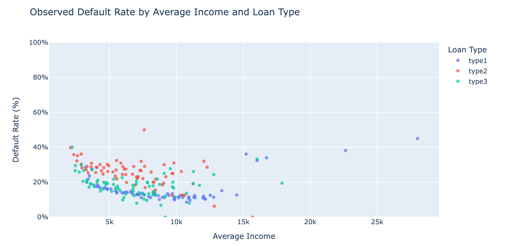

  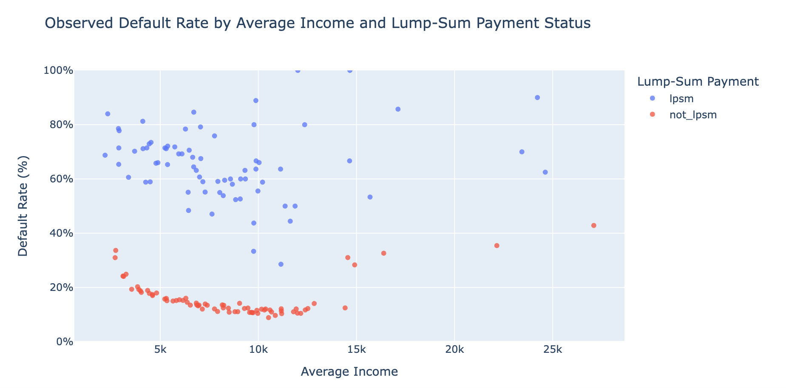

  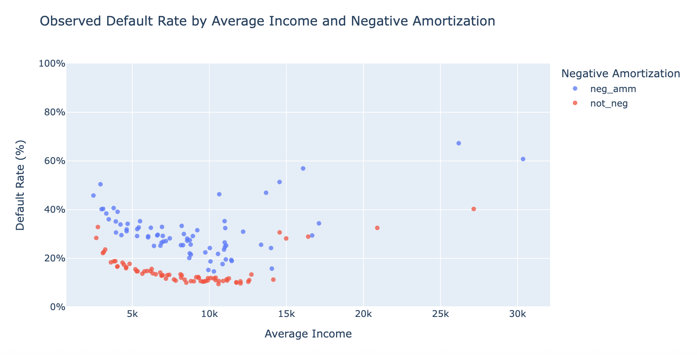

## 8. Preparing the Data for Modeling
The cleaned dataset was prepared for classification modeling by converting categorical features into numerical indicator variables. The target variable, Status, was separated from the predictor features, and the data was divided into training and testing sets using stratified sampling to maintain a similar proportion of default and non-default observations in both sets. The numerical features were then standardized using the training data so that features with different scales could be used consistently by the classification model. These steps prepared the dataset for baseline classification modeling while keeping the original information available for analysis.

## 9. Baseline Classification Model
A Logistic Regression classification model was developed as the baseline model for predicting loan default. The purpose of this model is to provide a measurable starting point against which additional models, improvements, and optimization techniques can be compared.

## 10. Model Evaluation and Performance Metric
The classification model was evaluated using accuracy, precision, recall, and F1 score. Since the dataset is imbalanced, multiple metrics were used instead of relying on accuracy alone. The baseline model achieved an accuracy of 69.27%, precision of 29.47%, recall of 64.16%, and an F1 score of 40.39%. The relatively low precision indicates that many observations predicted as defaults were actually non-defaults, while the recall of 64.16% shows that the model identified a substantial portion of the actual default cases.

The confusion matrix provides additional detail about the model's predictions. The model incorrectly predicted 1,401 actual default cases as non-defaults, representing false negatives. It also incorrectly predicted 6,001 actual non-default cases as defaults, representing false positives. These results show that the baseline model can identify a meaningful portion of default cases, but it also produces a considerable number of incorrect default predictions. As a baseline model, these results provide a measurable reference point for evaluating improvements in classification performance.

  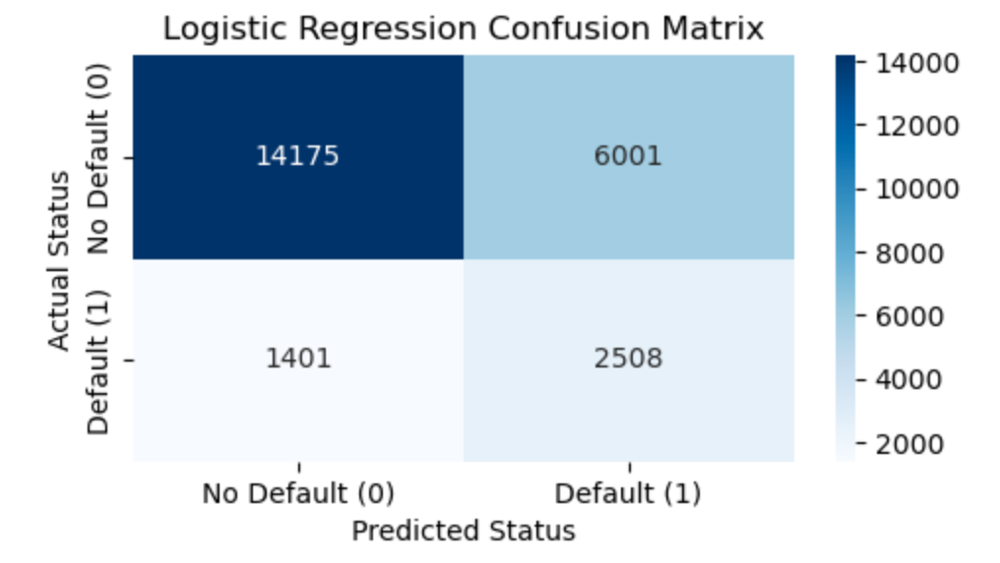

## 11. Results and Key Findings
The analysis identified several borrower and loan characteristics associated with different levels of observed default risk. The clearest patterns were found in Lump-Sum Payment and Negative Amortization, where borrowers with Lump-Sum Payment arrangements and Negative Amortization loans generally showed substantially higher observed default rates than borrowers in the corresponding categories. Loan type also showed meaningful differences, with Type 2 generally showing higher observed default rates than Type 1 across much of the analysis. Among numerical characteristics, lower income and higher Debt-to-Income Ratio were generally associated with higher observed default rates. Debt-to-Income Ratio also showed an important pattern across ranges, with the 50–60 range having the highest observed default rate at 42.67%.

The analysis also showed that these patterns can vary when characteristics are considered together. For example, the relationship between Debt-to-Income Ratio  and default rates differed across loan types and payment characteristics, while income generally showed a negative association with observed default rates across most categories, except for Lump-Sum Payment arrangements, where default rates remained high and widely distributed. This indicates that default risk is better understood through a combination of borrower and loan characteristics rather than a single feature. For a financial institution, these combined patterns can provide useful information for identifying borrower groups that may require closer credit-risk assessment.

Overall, the findings provide evidence that the dataset contains useful information for distinguishing borrowers associated with higher observed default risk. Classification modeling is therefore an important next step because it can consider multiple characteristics together and measure how effectively these patterns can be used to predict default and support more informed lending and credit-risk decisions.

## 12. Next Steps
The next steps will focus on improving and comparing the classification models. Additional models, including K-Nearest Neighbors, Decision Tree, and Support Vector Machine, can be evaluated alongside the baseline Logistic Regression model. Model performance will be compared using accuracy, precision, recall, and F1 score, with particular attention to identifying default cases. Further feature analysis and model optimization can also be explored to improve the ability to distinguish borrowers with different levels of observed default risk.

## 13. Outline of project
1. Define the project objective and research question.
2. Review and prepare the loan default dataset.
3. Clean the data and address missing values, duplicates, and anomalies.
4. Conduct exploratory data analysis to identify patterns and relationships.
5. Perform feature engineering and prepare the data for modeling.
6. Encode categorical features and standardize numerical features.
7. Develop a baseline Logistic Regression classification model.
8. Evaluate the baseline model using accuracy, precision, recall, F1 score, and a confusion matrix.
9. Summarize key findings and their relevance to lending and credit-risk decisions.
